# RoboND Project Write-up: 3D Perception by Gurparteek Bath

This write-up contains supporting statements and figures for each [rubric](https://review.udacity.com/#!/rubrics/1067/view) item that is used to assess the project.

**NOTE 1:** The code is in `perc_pipeline.py` in `RoboND-Perception-Project/pr2_robot/scripts` and not in `project_template.py`.

## Criteria 1:
Complete Exercise 1 steps. Pipeline for filtering and RANSAC plane fitting implemented.
### Supporting Statements for Criteria 1:
*Unfiltered Original Point Cloud:*

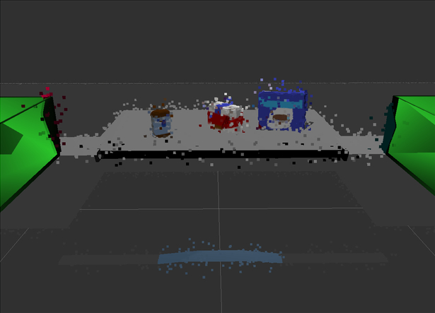

#### Filters from Exercise 1:
1.**PCL’s StatisticalOutlierRemoval Filter:**

This is a filtering technique in which, for each point in the point cloud, the distance to all its neighbors is calculated and then a mean distance is calculated.
Assuming a Gaussian Distribution all points whose mean distances are outside of an interval defined by the global distances mean+standard deviation are considered to be outliers and removed from the point cloud.

*Point Cloud after the StatisticalOutlierRemoval Filter:*

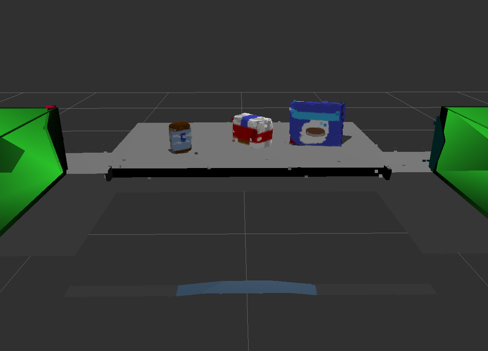

2.**Voxel Grid Down-sampling:**

The point clouds from RGB-D cameras are too dense, hence computationally expensive. Down-sampling the point cloud data to reduce density but preserve important information is ideal.
Using a Voxel Grid Filter where a grid of volumetric elements (voxels; as pixel is to picture element) is made and each voxel is averaged to a point cloud element; downsampled.

*Point Cloud after Voxel Grid Down-sampling:*

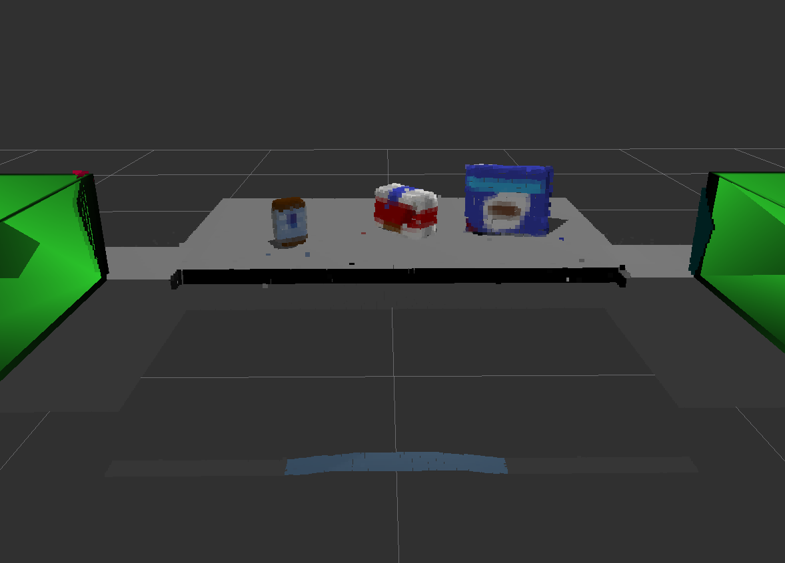

3.**PassThrough Filter:**

More points in cloud means more coumputation; so if the target object location is known, the rest of the point cloud is not needed.
A pass through filter is like a cropping tool. Specify an axis along which we know the limits within which the target objects lie, known as the region of interest and the pass through filter passes through the cloud leaving only the region of interest.

*Point Cloud after PassThrough Filter:*

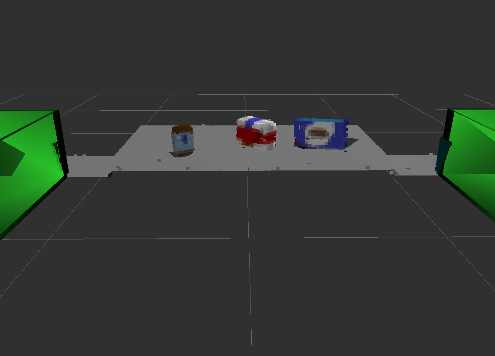

4.**RANSAC Plane Segmentation:**

RANSAC (Random Sample Consensus) is a two step (hypothesis and verification) iterative method which identifies data points belonging to a mathematical model (inliners) and those that dont (outliners).
First, the model is constructed using a min. no. of data pts. (eg. two for a line) and then the rest of pts. are verfied against its parameters (eg. slope and y-cutoff for a line) with certain error thresholds. The set of inliers obtained for that fitting model (random sample) is called a consensus set. The two steps are repeated until the obtained consensus set in certain iteration has enough inliers and that sample (mathematical model parameters) forms the solution as it had the most inliners in consensus.

*Point Cloud after RANSAC Plane Segmentation:*

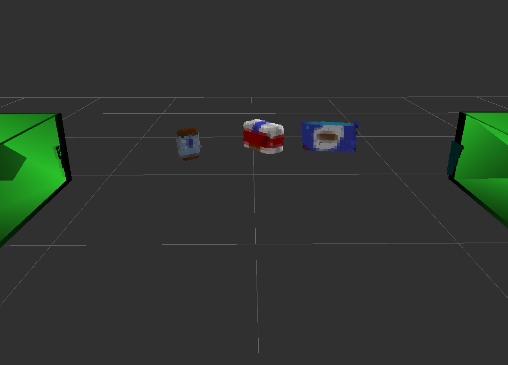

## Criteria 2:
Complete Exercise 2 steps: Pipeline including clustering for segmentation implemented.
### Supporting Statements for Criteria 2:

**Euclidean Clustering using k-d trees:**

Euclidean Clustering is the DBSCAN algorithm as it uses the Euclidean Distance to identfy nearest neighbours, if the distance b/w is < min. distance specified, then point is added to the cluster (inliners), else outliner. If the point has > (min. members of a cluster - 1) neigbours, it becomes a core member, else an edge member. Each point that can be in a cluster is identified and then the algorithm moves to the next random point.
Using k-d trees for nearest neighbor search for PCL's Euclidian Clustering (DBSCAN) algorithm to decrease the computational burden. k-d trees segment the Euclidian Space into partitions by divinding each dimension sequentially (at each root) into two each time (forming a tree) using the median for each dimension, same as in the Quick Sort partion method. Each point is then located in a partition and the seach is focussed there instead of the whole space.

*Point Cloud after Euclidean Clustering:*

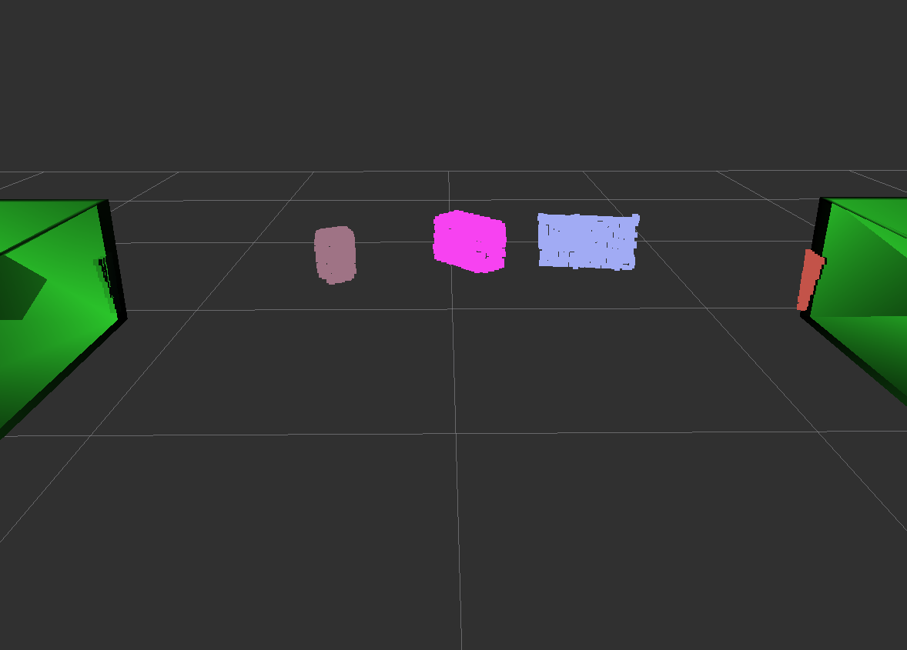

## Criteria 3:
Complete Exercise 3 Steps. Features extracted and SVM trained. Object recognition implemented.
### Supporting Statements for Criteria 3:

**NOTE 2**: Need the `sensor_stick` dir from the Perception Exercise 3 available in my [RoboND-Perception-Exercises GitHub Repo](https://github.com/gurparteek/RoboND-Perception-Exercises), to be in the `src` directory of the `catkin_ws` along with `RoboND-Perception-Project` with the model list in `capture_features.py` in `sensor_stick` edited to match the models of the environment as in `pick_list_(env#).yaml` files in `/pr2_robot/config/`.

**NOTE 3**: Depending upon the environment or world, change `scene_num = *` in `perc_pipeline.py` in `/RoboND-Perception-Project/pr2_robot/scripts` and `test*.world` and `pick_list_*.yaml` in `pick_place_project.launch` file in the `/pr2_robot/launch/` folder.

The functions `compute_color_histograms()` and `compute_normal_histograms()` are from `features.py` in `/sensor_stick/src/sensor_stick/` and are explained there.

Now, for each environment, after editing the model list in `capture_features.py` and changing the appropriate variables to reflect the right environment as mentioned in the note above, we can generate the features and train the SVM.

1.**Confusion matrices for environemnt or test scene 1:**

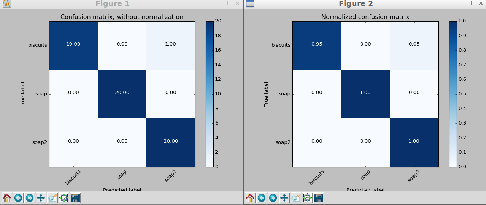

*Accuracy: 1.0*

2.**Confusion matrices for environemnt or test scene 2:**

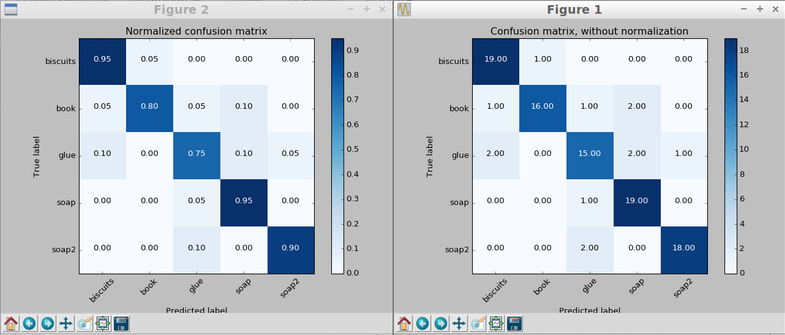

*Accuracy: 0.87(+/- 0.15)*

2.**Confusion matrices for environemnt or test scene 3:**

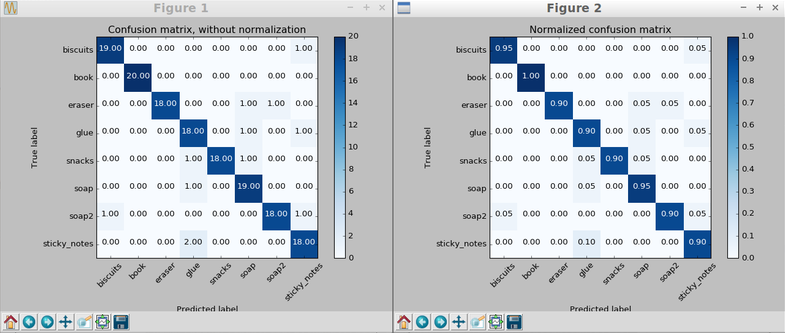

*Accuracy: 0.93(+/- 0.08)*

**NOTE 4**: The trained models, `model1.sav`, `model2.sav` and `model3.sav` are in the same directory as the main script `perc_pipeline.py` in `RoboND-Perception-Project/pr2_robot/scripts` so `cd` to there before running `rosrun pr2_robot perc_pipeline.py`.

## Criteria 4:
For all three tabletop setups (`test*.world`), perform object recognition, then read in respective pick list (`pick_list_*.yaml`). Next construct the messages that would comprise a valid `PickPlace` request output them to `.yaml` format.
### Supporting Statements for Criteria 4:

1.**Object Recognition for environemnt or test scene 1:**

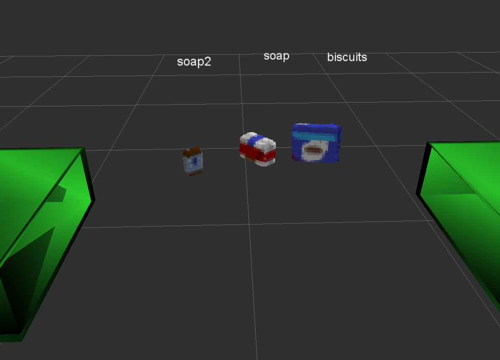

*Accuracy: 3/3*

2.**Object Recognition for environemnt or test scene 2:**

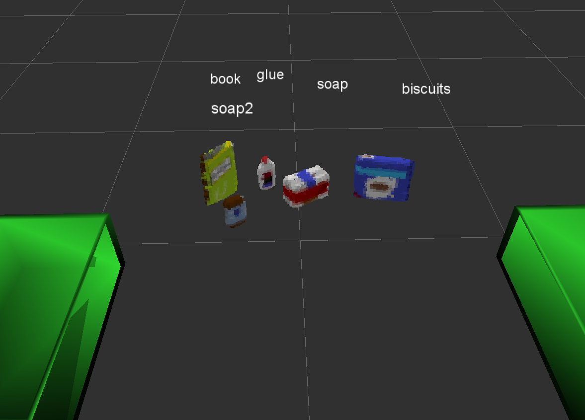

*Accuracy: 5/5*

3.**Object Recognition for environemnt or test scene 3:**

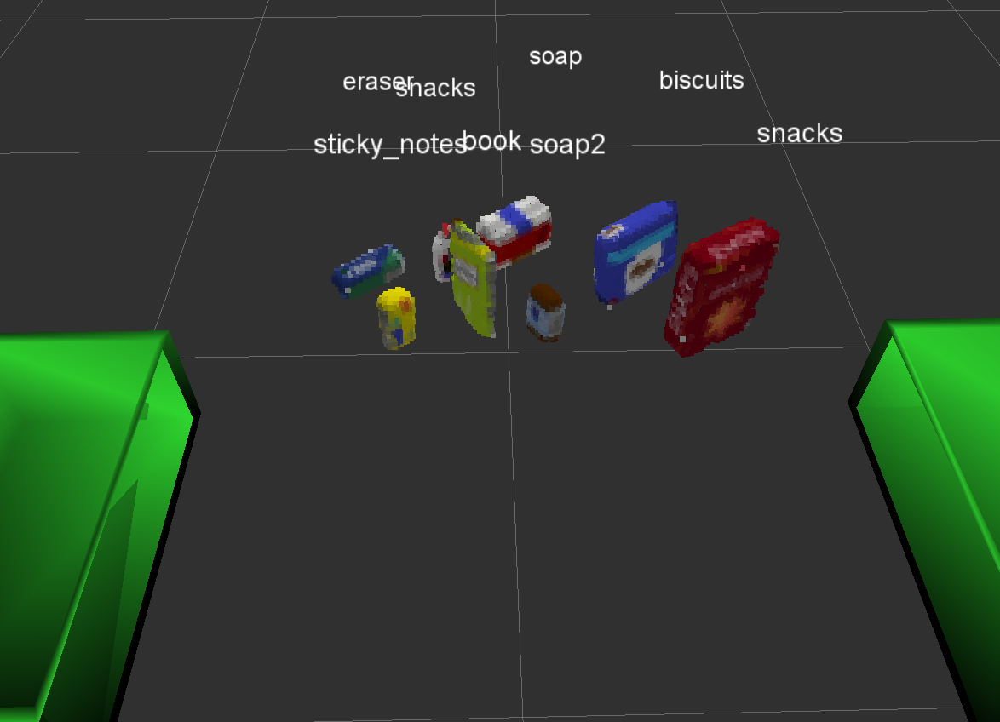

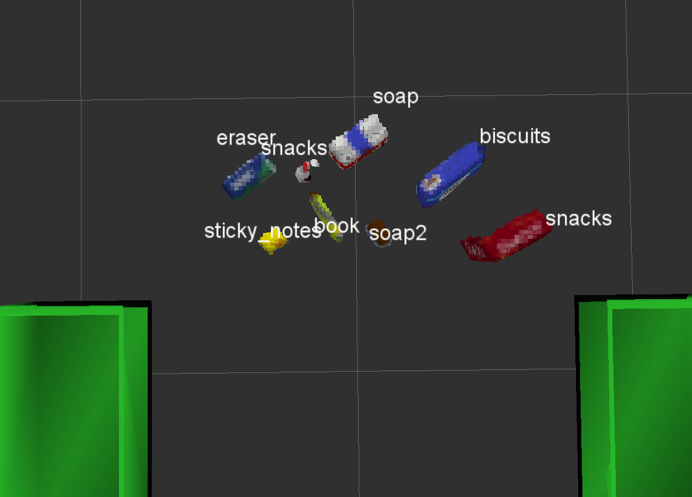

*Accuracy: 7/8*

4. **`.yaml` Output**

`pick_list_1.yaml`, `pick_list_2.yaml` and `pick_list_3.yaml` are in `RoboND-Perception-Project/pr2_robot/scripts`.